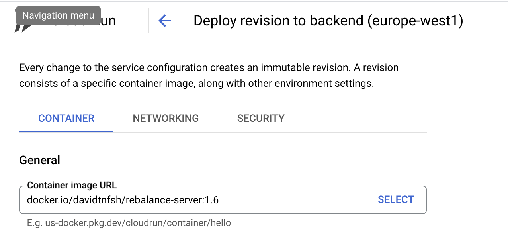

## Run

1. as API server: `flask --app rebalance_server --debug run -p 3001 --host=0.0.0.0` (making sure you're current location is at its parent folder)
2. docker;
    1. `docker build  -t rebalance-server .`
    2. `docker run --rm -it -p 3001:5000 rebalance-server`
## Install

* Without Docker:
    1. `poetry install`
    2. `npm install`
* With Docker: `docker build --platform linux/amd64 -t rebalance-server .`

## Data Source

1. DeBank: https://api.debank.com/bundle/complex_protocol_list?id=22830
2. Zapper: https://web.zapper.fi/v2/balances/apps?addresses[]=0x038919c63aff9c932c77a0c9c9d98eabc1a4dd08&addresses[]=0x43cd745bd5fbfc8cfd79ebc855f949abc79a1e0c&addresses[]=0x7ee54ab0f204bb3a83df90fdd824d8b4abe93222&addresses[]=0x89e930ff5e1f02be23c109a4e7fffe461e3ca6a0&addresses[]=0xe4bac3e44e8080e1491c11119197d33e396ea82b&networks[]=ethereum&networks[]=polygon&networks[]=optimism&networks[]=gnosis&networks[]=binance-smart-chain&networks[]=fantom&networks[]=avalanche&networks[]=arbitrum&networks[]=bitcoin&networks[]=cronos&networks[]=aurora

## Demo

```
Current gold: 51025.78 Target Sum: 36711.99 Investment Shift: 0.10, should be lower than 0.05
Suggestion: modify this amount of USD: -7440.95 for position glp-avax, current worth: 26525.51, percentage: 0.18
Suggestion: modify this amount of USD: -3612.06 for position stkcvxohmfraxbp-f-frax, current worth: 12876.25, percentage: 0.09
Suggestion: modify this amount of USD: -2881.28 for position glp-arbitrum, current worth: 10271.18, percentage: 0.07
Suggestion: modify this amount of USD: -379.50 for position fraxswapohm, current worth: 1352.84, percentage: 0.01
====================
Current cash: 27807.92 Target Sum: 36711.99 Investment Shift: -0.06, should be lower than 0.05
Suggestion: modify this amount of USD: 4122.97 for position stkcvxohmfraxbp-f-frax, current worth: 12876.25, percentage: 0.09
Suggestion: modify this amount of USD: 3434.60 for position vstfrax-f, current worth: 10726.44, percentage: 0.07
Suggestion: modify this amount of USD: 471.01 for position crveursusd, current worth: 1471.00, percentage: 0.01
Suggestion: modify this amount of USD: 433.18 for position fraxswapohm, current worth: 1352.84, percentage: 0.01
Suggestion: modify this amount of USD: 253.10 for position compound usdt, current worth: 790.44, percentage: 0.01
Suggestion: modify this amount of USD: 189.22 for position gdai, current worth: 590.94, percentage: 0.00
====================
Current stock: 38404.83 Target Sum: 36711.99 Investment Shift: 0.01, should be lower than 0.05
Suggestion: modify this amount of USD: -542.82 for position radiant-eth-lp, current worth: 12314.81, percentage: 0.08
Suggestion: modify this amount of USD: -538.90 for position kyber-avax-eth-lp, current worth: 12225.90, percentage: 0.08
Suggestion: modify this amount of USD: -393.21 for position dpx-weth, current worth: 8920.64, percentage: 0.06
Suggestion: modify this amount of USD: -95.30 for position cvxcrv, current worth: 2162.11, percentage: 0.01
Suggestion: modify this amount of USD: -57.75 for position vedpx, current worth: 1310.10, percentage: 0.01
Suggestion: modify this amount of USD: -52.48 for position magic-weth-sushi-lp, current worth: 1190.56, percentage: 0.01
====================
Current bond: 29609.45 Target Sum: 36711.99 Investment Shift: -0.05, should be lower than 0.05
Suggestion: modify this amount of USD: 3689.35 for position gohm, current worth: 15380.35, percentage: 0.10
Suggestion: modify this amount of USD: 3088.68 for position stkcvxohmfraxbp-f-frax, current worth: 12876.25, percentage: 0.09
Suggestion: modify this amount of USD: 324.51 for position fraxswapohm, current worth: 1352.84, percentage: 0.01
====================
Current Net Worth: $xxx
Your Annual Interest Rate would be xxx, Monthly return in NT$: xxx

Top 5 Revenue Farm this Month:
stkcvxohmfraxbp-f-frax: $759.36
radiant-eth-lp: $720.82
kyber-avax-eth-lp: $385.23
glp-avax: $353.73
glp-arbitrum: $160.48
Portfolio's APR: 22.20%
Portfolio's Sharpe Ratio (Useless until we have enough data points): 1.67
Portfolio's Max Drawdown: 0.36


=======Search top n pools consist of same lp token=======
glp-avax's possible better protocol to deposit (Current apyMean30d 0.16):
 - Chain: Avalanche, Protocol: yield-yak-aggregator, Token: GLP, APR: 0.36
 - Chain: Avalanche, Protocol: pangolin, Token: USDT-WAVAX, APR: 0.26
 - Chain: Arbitrum, Protocol: gmx, Token: GLP, APR: 0.25
fraxswapohm's possible better protocol to deposit (Current apyMean30d 0.00):
 - Chain: Ethereum, Protocol: conic-finance, Token: FRAX, APR: 0.23
 - Chain: Moonbeam, Protocol: moonwell-artemis, Token: FRAX, APR: 0.11
 - Chain: Ethereum, Protocol: stakedao, Token: FRAX, APR: 0.10
crveursusd's possible better protocol to deposit (Current apyMean30d 0.00):
 - Chain: BSC, Protocol: pancakeswap, Token: CAKE-BUSD, APR: 0.23
 - Chain: BSC, Protocol: alpaca-finance, Token: CAKE-BUSD, APR: 0.21
 - Chain: Ethereum, Protocol: stakedao, Token: CRV, APR: 0.20
gdai's possible better protocol to deposit (Current apyMean30d 0.10):
 - Chain: Arbitrum, Protocol: kyberswap-elastic, Token: MAI-GDAI, APR: 3.62
 - Chain: Optimism, Protocol: acryptos, Token: DAI, APR: 0.49
 - Chain: Optimism, Protocol: uniswap-v3, Token: WETH-DAI, APR: 0.37
compound usdt's possible better protocol to deposit (Current apyMean30d 0.02):
 - Chain: Optimism, Protocol: acryptos, Token: USDT, APR: 0.41
 - Chain: Ethereum, Protocol: ipor, Token: USDT, APR: 0.22
 - Chain: BSC, Protocol: pancakeswap, Token: CAKE-USDT, APR: 0.21
magic-weth-sushi-lp's possible better protocol to deposit (Current apyMean30d 0.41):
 - Chain: Arbitrum, Protocol: uniswap-v3, Token: MAGIC-WETH, APR: 1.19
 - Chain: Arbitrum, Protocol: beefy, Token: MAGIC-ETH, APR: 0.53
 - Chain: Ethereum, Protocol: uniswap-v3, Token: MATIC-WETH, APR: 0.43
dpx-weth's possible better protocol to deposit (Current apyMean30d 0.06):
 - Chain: Arbitrum, Protocol: zyberswap, Token: ZYB-WETH, APR: 2.62
 - Chain: Ethereum, Protocol: uniswap-v3, Token: PRIME-WETH, APR: 2.57
 - Chain: Ethereum, Protocol: uniswap-v3, Token: AGIX-WETH, APR: 1.95
cvxcrv's possible better protocol to deposit (Current apyMean30d 0.20):
 - Chain: Ethereum, Protocol: concentrator, Token: CVXCRV-CRV, APR: 0.41
 - Chain: Ethereum, Protocol: yearn-finance, Token: YCRV, APR: 0.33
 - Chain: Ethereum, Protocol: convex-finance, Token: CRV-YCRV, APR: 0.27
gohm's possible better protocol to deposit (Current apyMean30d 0.07):
 - Chain: Ethereum, Protocol: uniswap-v3, Token: GOHM-WETH, APR: 0.09


====================
Better stable coin:
- Chain: Ethereum, Pool: opyn-squeeth, Coin: USDC, TVL: 3.14M, Base APY: 51.35%,%
- Chain: Polygon, Pool: tangible, Coin: USDR, TVL: 7.75M, Base APY: 18.37%,%
- Chain: Solana, Pool: credix, Coin: USDC, TVL: 32.46M, Base APY: 14.57%,%
- Chain: Ethereum, Pool: sturdy, Coin: USDC, TVL: 6.66M, Base APY: 10.82%,%
- Chain: Avalanche, Pool: deltaprime, Coin: USDC, TVL: 6.57M, Base APY: 10.69%,%
```

## APIs

1. Prerequisite API: `curl -X GET "https://pro-openapi.debank.com/v1/user/all_complex_protocol_list?id=YOUR_WALLET_ADDRESS" \
    -H "accept: application/json" -H 'AccessKey: YOUR_KEY'`
2. Get the rebalance suggestions: `http://127.0.0.1:5000/?addresses=0xe4bAc3e44E8080e1491C11119197D33E396EA82B+0x43cd745Bd5FbFc8CfD79ebC855f949abc79a1E0C+0x43cd745Bd5FbFc8CfD79ebC855f949abc79a1E0C`

## Deploy

1. `docker build --platform linux/amd64 -t rebalance-server:<tag> .; docker tag rebalance-server:<tag> davidtnfsh/rebalance-server:<tag>; docker push davidtnfsh/rebalance-server:<tag>;`
2. update tag version in Cloud run:
    